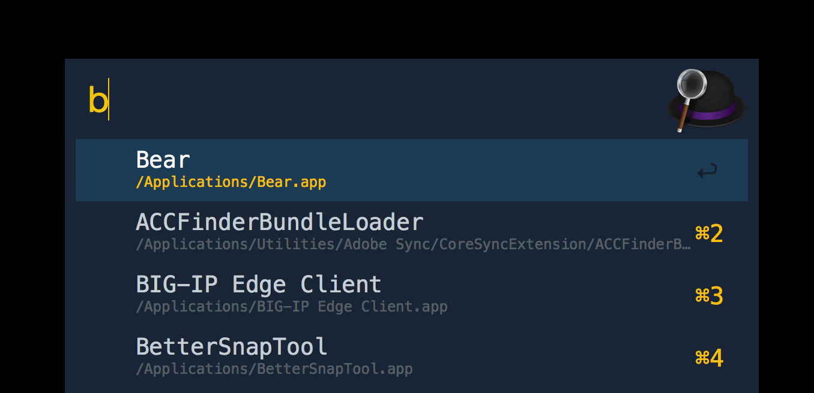

# alfred-bundlephobia [](https://travis-ci.org/prashantpalikhe/alfred-bundlephobia)

> Alfred 3 workflow to find a JavaScript bundle size




## Install

```
$ npm install --global alfred-bundlephobia
```

*Requires [Node.js](https://nodejs.org) 4+ and the Alfred [Powerpack](https://www.alfredapp.com/powerpack/).*


## Usage

In Alfred, type `bundlephobia`, <kbd>Enter</kbd>, and your query.


## License

MIT © [Prashant Palikhe](https://github.com/prashantpalikhe/alfred-bundlephobia)
